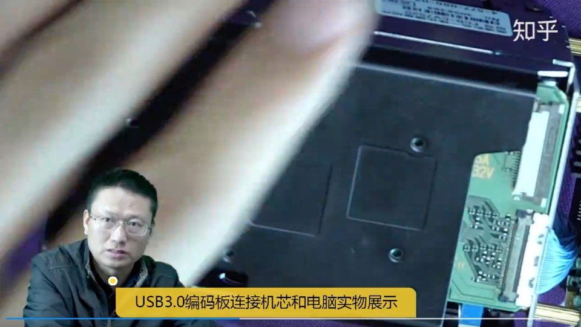
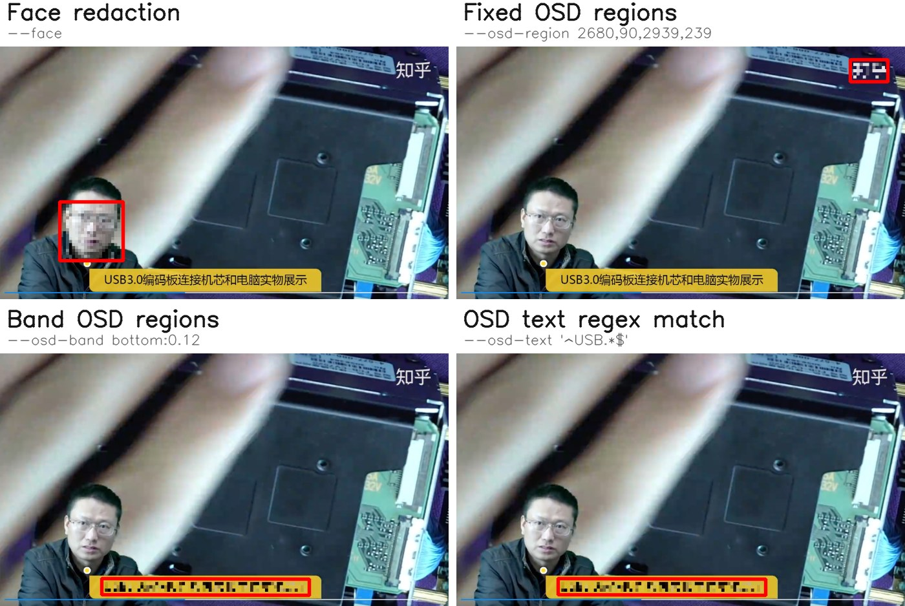

# media-redact

> **中文简介**：[docs/README_CN.md](docs/README_CN.md)

Face and on-screen overlay (OSD) redaction for images and videos.

| Original frame | Redact output |
| -------------- | ------------- |
|  |  |

## Publish

See [docs/ROADMAP.md](docs/ROADMAP.md).

- **v0.1**: Face detection + fixed-region OSD + image/video CLI
- **v0.2**: Python API, batch processing
- **v0.3** (current): OCR-based OSD text detection

## Features

- **Face redaction**: ONNX-based detection with blur / mosaic / solid
- **Fixed OSD regions**: Redact user-defined rectangles or polygons via `--osd-region` (absolute pixel coordinates)
- **Band OSD regions**: Limit text detection to top/bottom/left/right bands via `--osd-band`; redact all detected text in band
- **OSD text regex match**: PP-OCRv6 detection + OCR; redact only boxes whose recognized text matches `--osd-text` patterns
- **Region annotation**: Companion web tool `media-region` for drawing regions and band ratios in a browser
- **Python API & CLI batch**: Process directories with preserved layout (recursive by default; `-o` / `--output`, use `--no-recursive` to disable)

## User guide

[docs/USER_GUIDE.md](docs/USER_GUIDE.md)

## Developer guide

[docs/DEVELOPER_GUIDE.md](docs/DEVELOPER_GUIDE.md)

## Acknowledgments

Thanks to the following teams and individuals for their outstanding work:

- [deface](https://github.com/ORB-HD/deface)
- [PaddleOCR](https://github.com/PaddlePaddle/PaddleOCR) 
- [Demo image source](https://www.zhihu.com/zvideo/1375093765468659712) (if you believe this infringes your rights, please contact me and I will remove it)

## License

TBD